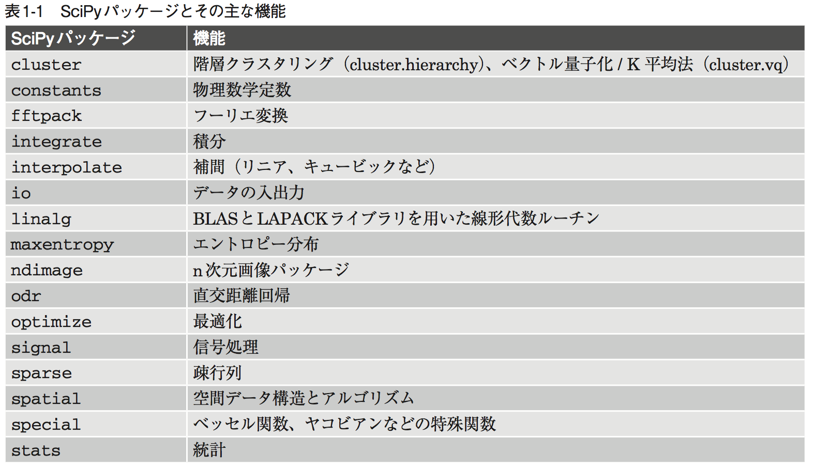
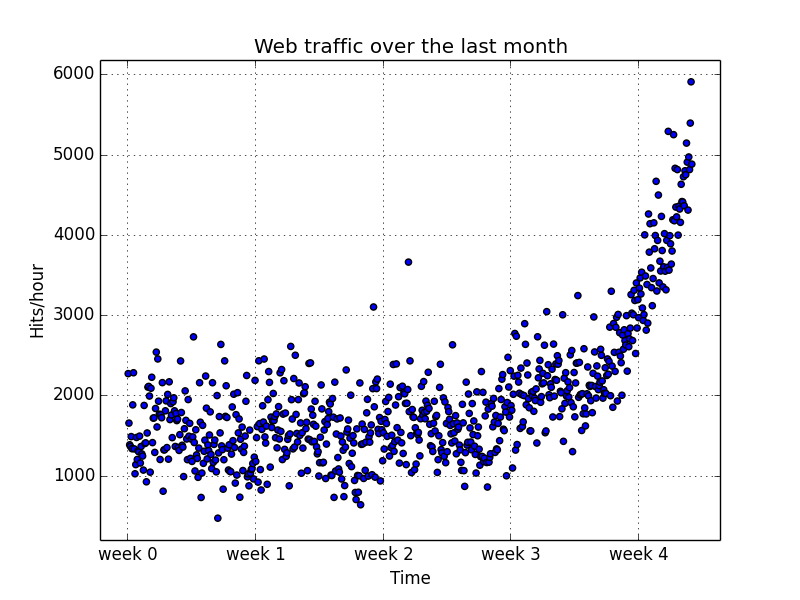
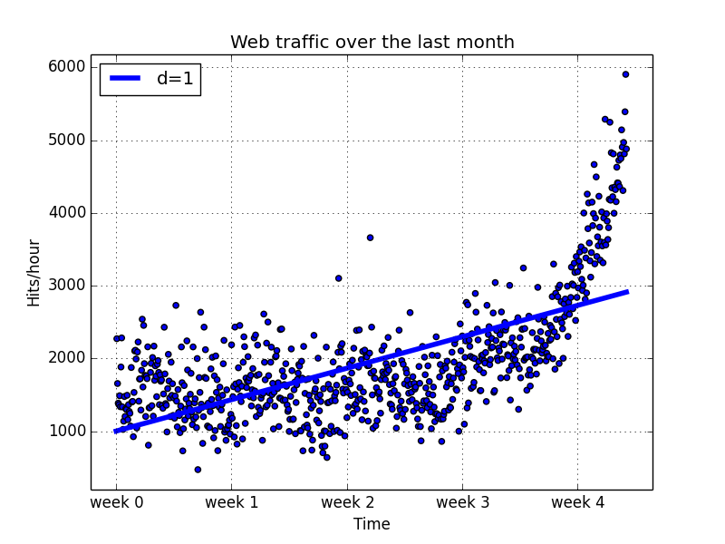
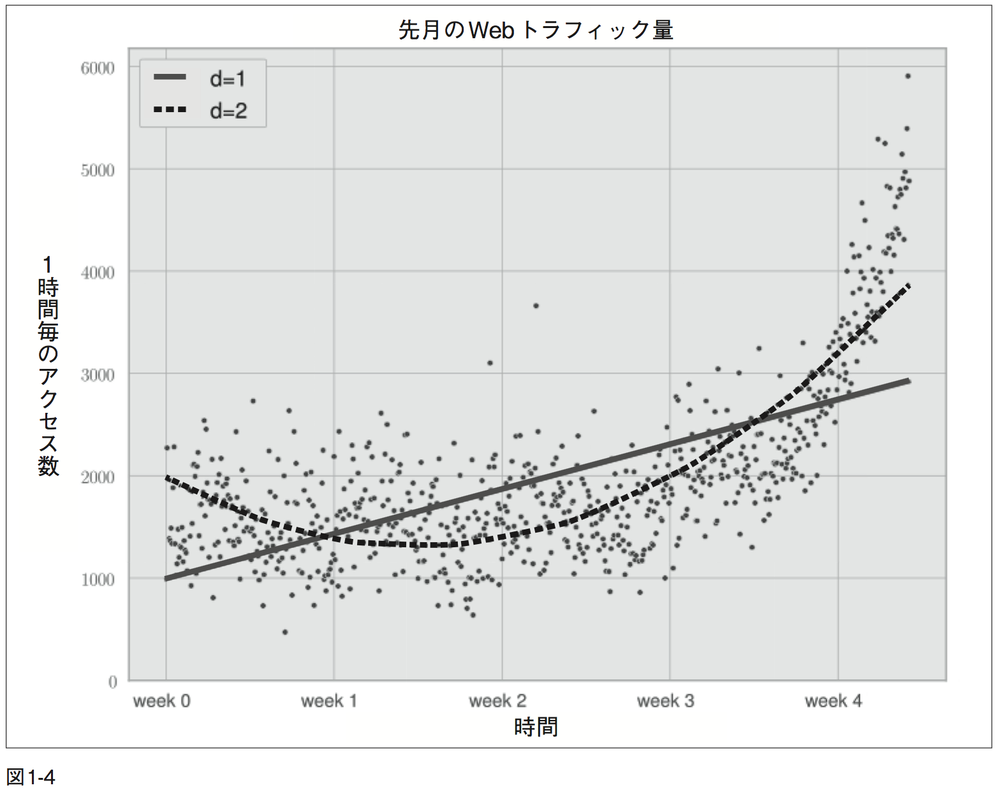
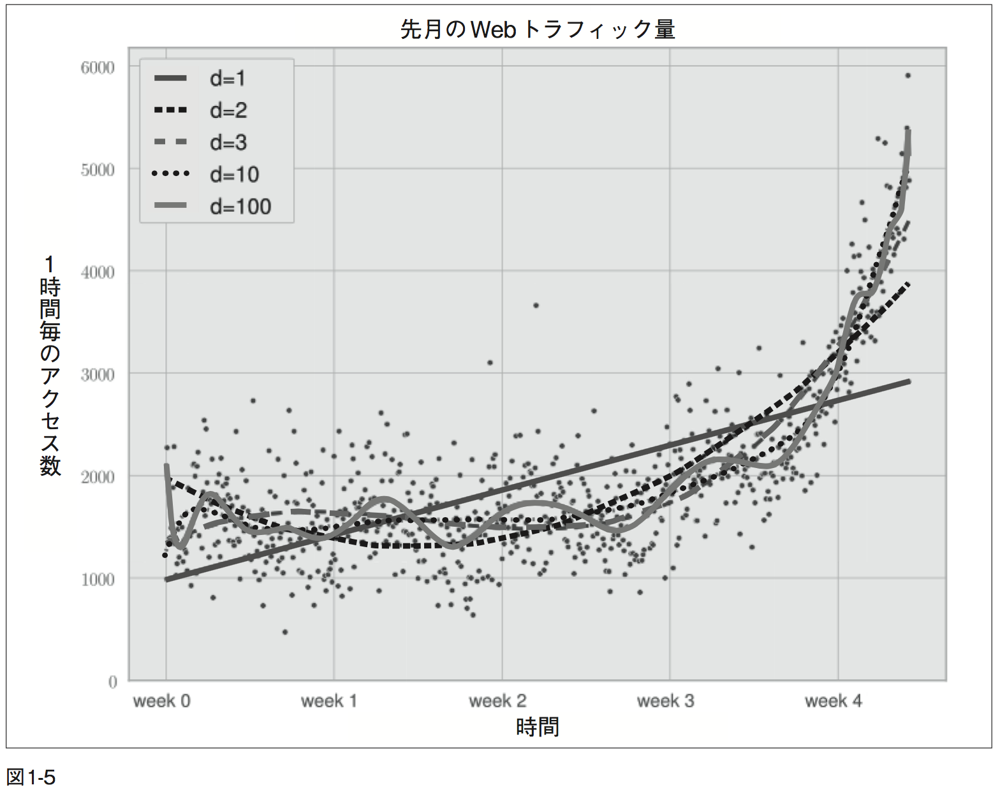
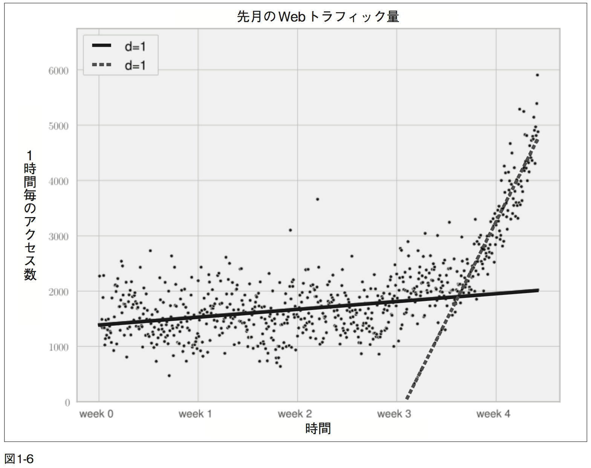
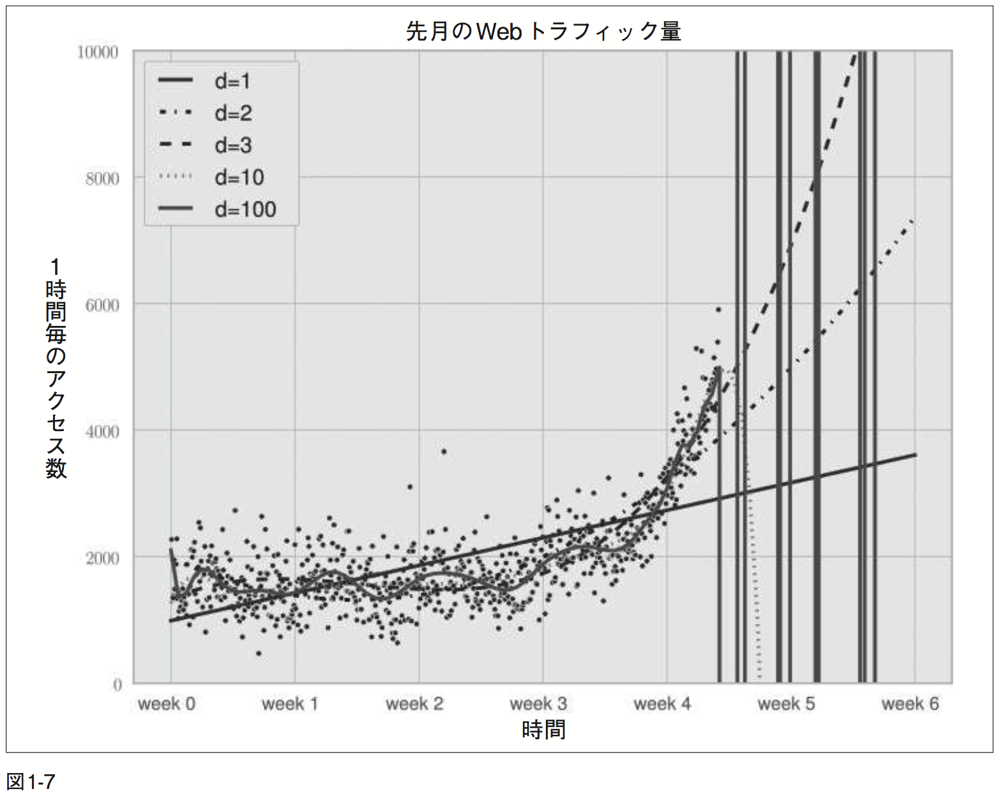
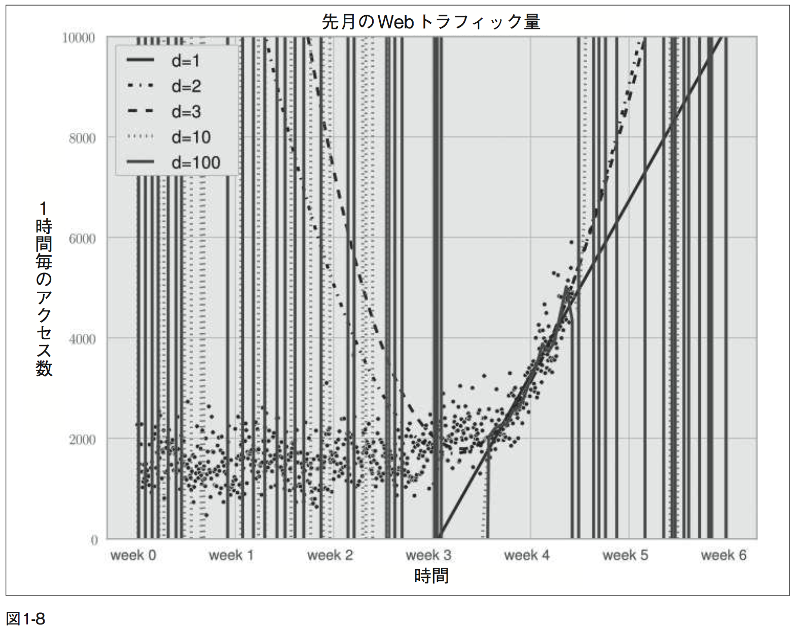

# Bulding Machine Learning Systems with Python
# 実践 機械学習

## 前提知識

- Python 2.7
- easy_install, pip が使える
- NumPy 1.6.2
- SciPy 0.11
- Scikit-learn 0.13


## 1 Python ではじめる機械学習

- **機械学習（Machine Learning）**を用いることでコンピュータに様々な問題の解決方法を学習させられる。
- しかし、機械学習について学習することは複雑。
	- 無数にあるアルゴリズムの中からどれを選ぶべきか？
	- 全体の設定は正しいのか？
	- 最適な結果は得られているのか？
	- より適したアルゴリズムが他にないことをどうやって判断するのか？
	- 集めたデータは「正しい」データだったのか？
- これらの経験をこの本から学べるといい。


## 1.1 機械学習と Python はドリームチーム

- 機械学習を用いることで、いくつかの例（上手く行った時のデータ（正例）、または失敗した時のデータ（負例））をコンピュータに与え、問題の解法を学習させられる。
	- 例えばメールの振り分け。（本文参考）
- 機械学習のアプリケーションで成果を上げた事例は多い。（c.f. [kaggle.com](http://www.kaggle.com/), [kaggle wikipedia](http://ja.wikipedia.org/wiki/Kaggle)）
- 機械学習は試行錯誤。
- 試行錯誤することとインタプリタ型の言語と相性がいい。
- その中でも Python は多くのライブラリを持っているため、機械学習に非常に適している。


## 1.2 本書が扱う内容（そして、扱わない内容）

- 機械学習においての流れ：
	1. データを読み込み、データを整形
	2. 入力データの調査及び解釈を行う
	3. 学習アルゴリズムにどのような形でデータを入力するのがふさわしいか分析
	4. 正しいモデルと学習アルゴリズムを選択
	5. 結果に対して正確な評価を行う


## 1.3 困った時は

- [MetaOptimize](http://metaoptimize.com/qa/)
	- 機械学習に焦点を当てた Q&A サイト。
- [Cross Validated](http://stats.stackexchange.com)
	- MetaOptimized に似ているが、統計に関する問題を多く扱っている。
- [Stack Overflow](http://stackoverflow.com)
	- みんな大好きすスタックオーバーフロー。プログラミングに関して広範囲をカバーした Q&A サイト。
	- 日本語版（まだベータ版だが）も少し前に開設された。（c.f. [スタックオーバーフロー](http://ja.stackoverflow.com/)）
- Freenode の #machinelearning タグ
	- 機械学習を対象とした IRC（Internet Relay Chat）チャンネル。
- [TwoToReal](http://www.twotoreal.com/)
	- 筆者が行っている Q&A サイト（ステマ）。


## 1.4 はじめに

### 1.4.1 NumPy, SciPy, Matplotlib 入門

- Python が遅い？まあそうかもしれない。
- しかしそれでも多くの科学者や企業が Python を使い続ける。なぜか。
- それは重たい処理を C や Fortran で拡張された低レイヤーに丸投げすることが簡単で、実際に Numpy と Scipy 内部ではそうなっている。
- さらにグラフ作成において Matplotlib はおそらく最も便利で高機能なライブラリ。

### 1.4.2 インストール方法

- みんなもうインストールしてるよね。
- インストールしてない人は pip コマンド叩いてね。

### 1.4.3 NumPy、SciPy による効率的なデータ操作

- この本では基本的な使い方を紹介するけど、より詳しく、網羅的に、体系的に知りたい人は下のところ見てみてね。
- NumPy
	- [http://www.scipy.org/Tentative_NumPy_Tutorial](http://www.scipy.org/Tentative_NumPy_Tutorial)
	- 「NumPy Beginnger's Guide」
	- [python/numpy - 機械学習の「朱鷺の杜Wiki」](http://ibisforest.org/index.php?python%2Fnumpy)
- SciPy
	- [SciPy Tutorial](http://docs.scipy.org/doc/scipy/reference/tutorial)
	- [SciPy Guide](http://scipy-lectures.github.com)

### 1.4.4 NumPy 入門

#### 行列の操作

```python
>>> import numpy
>>> print np.version.full_version # バージョン確認
1.8.0rc1
>>> from numpy import * # 名前空間が汚染してしまうのでこのやり方は良くない
>>> import numpy as np # こっちのがおすすめ（ていうかテンプレ）
>>> a = np.array([0, 1, 2, 3, 4, 5]) # numpy.array 配列
>>> a.ndim # 次元数
1
>>> a.shape # 各次元の大きさ
(6,)
>>> b = a.reshape((3, 2))
array([[0, 1],
       [2, 3],
       [4, 5]])
>>> b.ndim
2
>>> b.shape
(3, 2)
```

#### コピー

- Numpy はできるだけ無駄なコピーをしない。

```python
>>> b[1][0] = 77
>>> b
array([[ 0, 77],
       [ 2,  3],
       [ 4,  5]])
>>> a
array([ 0, 77,  2,  3,  4,  5])
>>> # b は a と関連付けされていて、b を修正したら a も修正されてしまう
>>> c = a.reshape((3, 2)).copy()
>>> c
array([[-99,  77],
       [  2,   3],
       [  4,   5]])
>>> a
array([ 0, 77,  2,  3,  4,  5])
```

#### 要素に対して演算が行われる

```python
>>> a
array([ 0, 1,  2,  3,  4,  5])
>>> a*2
array([ 0,  2,  4,  6,  8, 10])
>>> a**2
array([ 0,  1,  4,  9, 16, 25])
>>> # 対して Python のリストでは
>>> [0, 1, 2, 3, 4]*2
[0, 1, 2, 3, 4, 0, 1, 2, 3, 4]
>>> [0, 1, 2, 3, 4]**2
TypeError: unsupported operand type(s) for ** or pow(): 'list' and 'int'
```

#### インデックス

```python
>>> a
array([5, 4, 33, 2, 1, 0])
>>> a[[1,3,5]] # インデックス用の配列を使って操作できる
array([4, 2, 0])
>>> a>2 # 条件を満たす要素だけを取り出すこともできる
array([ True,  True,  True, False, False, False], dtype=bool)
>>> a[a>2]
array([5, 4, 33])
>>> a[a>2] = 2 # これを使うと、条件から外れた要素を一定の値に揃えることができる
array([2, 2, 2,  2,  1,  0])
>>> a.clip(1, 3) # よく使う clip 関数。要素を指定された値（上限と下限）に収まるように修正できる。
array([3, 3, 3, 2, 1, 1])
```

#### 不適切な値への対応

- NumPy のインデックス操作は、テキストファイルから読み込んだデータを扱いやすい形に整形する段階(前処理)で威力を発揮。
- 読み込んだデータの中に不適切な値が含まれることは多くありる場合、次のように numpy.NAN を用いて、数値ではないという印を付ける。

```python
>>> c = np.array([1, 2, np.NAN, 3, 4]) # テキストファイルから読み込んだと仮定
>>> c
array([ 1., 2., nan, 3., 4.])
>>> np.isnan(c)
array([False, False, True, False, False], dtype=bool)
>>> c[~np.isnan(c)] # is not np.NAN
array([ 1., 2., 3., 4.])
>>> np.mean(c[~np.isnan(c)])
2.5
```

#### 処理速度の比較

- 1 から 1000 までの二乗和を計算。
- 正確を期すため、同じ処理を 10000 回繰返してその合計を求める。

```python
import timeit
normal_py_sec = timeit.timeit('sum(x*x for x in xrange(1000))', number=10000)
naive_np_sec = timeit.timeit('sum(na*na)', setup="import numpy as np; na=np.arange(1000)", number=10000)
good_np_sec = timeit.timeit('na.dot(na)', setup="import numpy as np; na=np.arange(1000)", number=10000)

print("Normal Python: %f sec"%normal_py_sec)
print("Naive NumPy: %f sec"%naive_np_sec)
print("Good NumPy: %f sec"%good_np_sec)
```
```
# テキスト
Normal Python: 1.157467 sec
Naive NumPy: 4.061293 sec
Good NumPy: 0.033419 sec
```
```
# 実測
Normal Python: 0.748303 sec
Naive NumPy: 4.536467 sec
Good NumPy: 0.023346 sec
```

- numpy をデータ格納に使用した場合普通の python のリストよりも 3.5 から 6 倍もの時間がかかってしまう。
	- Python から（NumPy のメソッドを通じて）配列要素にアクセスするのに、通常より時間を要しているため。
	- 処理速度を向上させるためには、最適化されたライブラリ内で処理を完結させる必要がある。
		- それが `np.dot()`（通常の python のリストより 25〜35 倍も早くなる）
- 速さには代償がつきもの
	- Python のリストにはどんなデータタイプでも格納できるが、NumPy の場合は一種類のみ。
	- 異なるデータタイプを使用する時は、できるだけ一貫性が保たれるような共通のデータタイプに変形される。

```python
>>> np.array([1,2,3]).dtype
dtype('int64')
>>> np.array([1., 2., 3.]).dtype
dtype('float64')
>>> np.array([1, 'stringy'])
array(['1', 'stringy'], dtype='|S7')
>>> np.array([1, 'stringy', set([1, 2, 3])])
array([1, 'stringy', set([1, 2, 3])], dtype=object)
```

- `dtype='|S7'` はなんぞって人は [stack overflow[](http://)](http://stackoverflow.com/questions/14790130/dtypes-difference-between-s1-and-s2-in-python) へどうぞ

### 1.4.5 Scipy 入門

- 効率的なデータ構造である NumPy の配列を利用して、SciPy は多くのアルゴリズムを提供。
- 数値計算に関する書籍に載っているアルゴリズムならば、大抵のものは SciPy にも実装済み。
- SciPy の名前空間からでも NumPy の名前空間にアクセスすることができる。

```python
>>> import scipy, numpy
>>> scipy.version.full_version
0.13.0b1
>>> scipy.dot is numpy.dot
True
```

- Scipy のパッケージたち（表1-1参照）
- 主に扱うパッケージは、`scipy.stats`、`scipy.interpolate`、`scipy.cluster`、`scipy.signal`



## 1.5 初めての（簡単な）機械学習アプリケーション

- 「MLAAS」という架空の会社を想定。
- HTTP 経由で機械学習に関するアルゴリズムを販売して収益を得る。
- 「現在のインフラがいつ限界に達するか？」
	- 現在は1時間に100000件のリクエストに対応できる。
	- クラウドにあるサーバを増築しなければならない時期を事前に予測し、余分なサーバ費用をできるだけ発生させずに、Webリクエストの増加に対応したい。

### 1.5.1 データを読み込む

- `ch01/data/web_traffic.tsv`
- 行ごとに、時間にインデックスとその時間におけるアクセス数

```python
>>> import scipy as sp
>>> data = sp.genfromtxt('web_traffic.tsv', delimiter='\t') # タブ区切り
>>> print data[:10]
[[  1.00000000e+00   2.27200000e+03]
 [  2.00000000e+00   1.65600000e+03]
 [  3.00000000e+00   1.38600000e+03]
 [  4.00000000e+00   1.36500000e+03]
 [  5.00000000e+00   1.48800000e+03]
 [  6.00000000e+00   1.33700000e+03]
 [  7.00000000e+00   1.88300000e+03]
 [  8.00000000e+00   2.28300000e+03]
 [  9.00000000e+00   1.33500000e+03]
 [  1.00000000e+01   1.02500000e+03]]
>>> print data.shape # 2次元のデータポイントが743個あることが分かる
(743, 2)
```

### 前処理とデータ整形

- 処理を行うとき、データをじげんごとに分割して2つのベクトルとして扱ったほうが都合がいい。

```python
>>> x = data[:, 0] # 経過時間ベクトル
>>> y = data[:, 1] # アクセス数ベクトル
>>> sp.sum(sp.isnan(y)) # nanの数
0
```

#### データの感じをつかむために matplotlib を使って散布図を作成してみる

```python
import matplotlib.pyplot as plt
plt.scatter(x,y)
plt.title("Web traffic over the last month")
plt.xlabel("Time")
plt.ylabel("Hits/hour")
plt.xticks([w*7*24 for w in range(10)], ['week %i'%w focp r w in range(10)]) plt.autoscale(tight=True)
plt.grid()
plt.show()
```



- 最後の週で急に増加している。

### 1.5.3 正しいモデルの選択と機械学習

- 今のサーバで、いつまでトラフィックに耐えることができるか？
	- ノイズの含まれたデータに対して、その背後にある本当のモデルを見つける。
	- そのモデルを用いて、インフラがパンクする時期を予測する。

#### 初めてのモデル構築

- 「モデル」は、複雑な現実世界で起こる現象を理論的に単純化して近似したもの。
- 近似することで常に誤差が生じる。
- 誤差を手がかりに、正しいモデルを選択。
- 誤差をユークリッド平方距離とする。

```python
def error(f, x, y):
	return sp.sum((f(x) - y) ** 2)
```

#### 単純な直線で近似する

- 先のグラフ上で、どのように直線を配置したら近似誤差を最小にできるか。
- それが`sp.polyfit()`
- x と y と多項式の次元（直線の場合は1）を指定すると、誤差を最小とするモデル関数を得ることができる。

```python
>>> fp1, residuals, rank, sv, rcond = sp.polyfit(x, y, 1, full=True)
>>> # 通常はモデルパラメータのみ必要であり、その場合は full=True の指定は必要はない。
>>> print 'Model parameters: %s' % fp1
array([    2.57152281,  1002.10684085])
>>> print residuals
[  3.19874315e+08]
```

- `polyfit()` 関数は近似したモデル関数についてのパラメータである `fp1` を返す。
- また引数で `full=True` と指定することで、近似プロセスについてさらに情報を得ることができる。
	- `residuals`, `rank`, `sv`, `rcond` がそれに該当。
	- 今は近似誤差である `residuals` が必要
- つまり次の関数が最適な近似関数。

`f(x) = 2.57152281 * x + 1002.10684085`

- また、モデルパラメータからモデル関数を作ることができる。

```python
>>> f1 = sp.poly1d(fp1)
>>> print error(f1, x, y)
319874314.777
```

- では `f1()` を用いて訓練データから学習したモデルを描画。

```python
fx = sp.linspace(0,x[-1], 1000) # プロット用に"x値"を生成
plt.plot(fx, f1(fx), linewidth=4)
plt.legend(["d=%i" % f1.order], loc="upper left")
```



- 不適切なモデルであるが、単純のためベースラインとして使用。

#### より進んだやり方へ

- 「次数が2の多項式曲線」

```python
>>> f2p = sp.polyfit(x, y, 2)
>>> print(f2p)
array([ 1.05322215e-02, -5.26545650e+00, 1.97476082e+03])
>>> f2 = sp.poly1d(f2p)
>>> print(error(f2, x, y))
179983507.878
```

- 誤差は縮まったがパラメータが増えた。
- フィッティング曲線は以下のようになる。

`f(x) = 0.0105322215 * x**2 - 5.26545650 * x + 1974.76082`



- では更に次数を増やしてみるとどうなるのか？次数を3, 10, 100で見てみよう（図1−5参照）
- 誤差はたしかに縮まっている。

```
Error d=1: 317,389,767.33977
Error d=2: 179,983,507.878179
Error d=3: 139,350,144.031725
Error d=10: 121,942,326.363461
Error d=100: 109,318,004.475556
```



- でも曲線をみると、本当に正しく表現できているのか？と疑問に感じる。
- 次数が100の場合を見ると、短い周期で振動するような曲線になっている。
- つまりデータに適応しすぎている。
	- これではデータに含まれるノイズまでも捉えてしまっている。
	- これを過学習（overfitting）と呼ぶ。
- この時、取るべき行動は3つ。
	- 多項式モデルからどれか1つ選ぶ。
	- より複雑なモデル（スプライン曲線など）に切り替える。
	- データについて別の視点で考え、初めからやり直す。
- 次数が1のは単純すぎる、10と100は過学習。2と3は近いけど右端の部分の傾きが異なる。
- より複雑なモデル、という方向性もも違っている。

#### データを違う視点から眺める

- 3週と4週の間で急に変化している。
- 3.5週を境にしてデータを分割して2つの直線で近似してみよう。

```python
inflection = 3.5*7*24 # 変化点(急に変化する点)の時間を計算
xa = x[:inflection] # 変化点前のデータポイント
ya = y[:inflection]
xb = x[inflection:] # 変化点後のデータポイント
yb = y[inflection:]

fa = sp.poly1d(sp.polyfit(xa, ya, 1))
fb = sp.poly1d(sp.polyfit(xb, yb, 1))

fa_error = error(fa, xa, ya)
fb_error = error(fb, xb, yb)
print("Error inflection=%f" % (fa_error + fb_error))
Error inflection=156,639,407.701523
```

- これでできたのが図1−6。今までのよりはよさげ。
- でも誤差は大きいまま。
- 「なぜ最後の週のデータを直線で近似するのが良いと考えたのか？ なぜそれが他の複雑なモデルより優れていると考えたのか？」
- 他のモデルよりも正確に予想してそうだと考えたから。
- 今までのモデルについて、未来についてグラフを描画すると、正しいモデルについての見識が得られる。（図1−7）
- 次数10と100は過学習で全く予想できてない。次数が低いモデルは未学習（underfitting）でデータを正しく掴み取れてない。
- 次数が2と3のモデルを最後の週のデータだけで学習するとどうなるか。（図1−8）







#### 訓練データとテストデータ

- まず全データの数 % だけを保持 (ホールドアウト)しておき、残りのデータを使って学習。
- そして、保持したデータ(これをホールドアウトデータ)を用いて誤差を計算する。
- 「学習モデルが新しいデータについてどう振る舞うか」といったより現実的な視点で評価できる。
- 変化点以降のデータを使用して学習したモデルに対して、テストデータを用いて誤差を計算。

```python
frac = 0.3 # テストに用いるデータの割合
split_idx = int(frac * len(xb))
# 全データの30%をランダムに選び出す
shuffled = sp.random.permutation(list(range(len(xb))))
test = sorted(shuffled[:split_idx]) # テスト用のデータインデックス配列 train = sorted(shuffled[split_idx:]) # 訓練用のデータインデックス配列

# それぞれ訓練データを用いて訓練を行う
fbt1 = sp.poly1d(sp.polyfit(xb[train], yb[train], 1))
fbt2 = sp.poly1d(sp.polyfit(xb[train], yb[train], 2))
fbt3 = sp.poly1d(sp.polyfit(xb[train], yb[train], 3))
fbt10 = sp.poly1d(sp.polyfit(xb[train], yb[train], 10))
fbt100 = sp.poly1d(sp.polyfit(xb[train], yb[train], 100))

# それぞれテストデータを用いて評価を行う
for f in [fbt1, fbt2, fbt3, fbt10, fbt100]:
	print("Error d=%i: %f" % (f.order, error(f, xb[test], yb[test])))
```

- これでの結果。

```
Error d=1: 7,917,335.831122
Error d=2: 6,993,880.348870
Error d=3: 7,137,471.177363
Error d=10: 8,805,551.189738
Error d=100: 10,877,646.621984
```

- 次数2のモデルが一番良かった。
- テストデータはモデルが訓練データに含まれていないため、未来の新しいデータに対しても同様に信頼できると言える。

#### 最初の質問に対する答え

- 時間あたりのリクエストが 100,000 を超える時期を予想。
	- いつ 100,000 に達するか計算して求めれば良い。
	- `f(x) = 0` となる `x` を求める。

```python
>>> print(fbt2)
0.08844 x2 - 97.31 x + 2.853e+04
>>> print(fbt2-100000)
0.08844 x2 - 97.31 x - 7.147e+04
>>> from scipy.optimize import fsolve
>>> reached_max = fsolve(fbt2-100000, 800)/(7*24)
>>> print("100,000 hits/hour expected at week %f" % reached_max[0])
100,000 hits/hour expected at week 9.827613
```

- week 9.8 で限界を迎える。

## 1.6 まとめ

- 大切なこと2つ。
	- データを理解しデータを扱いやすい形に整形する。（かのK町先生も実験ではデータの前処理が8割と仰ってた）
	- 正しい評価を行う。
		- これにあたって、訓練データとテストデータを区別することは極めて重要。